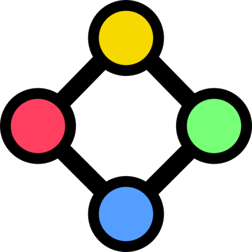

#  [Chromatic Warfare](https://cw.slama.dev/)

A competitive turn-based strategy game system designed for bots.
Players control vertices on directed graphs, moving units and engaging in strategic combat to eliminate opponents.

**See [game/bot/](game/bot/) for how to play.**

## Game Overview
This repository contains

- [**Python Game Server**](game/) + [**Python Bot Library**](game/bot/)
- [**HTML/JS Web Viewer**](viewer/)

The communication is implemented via Websockets.
